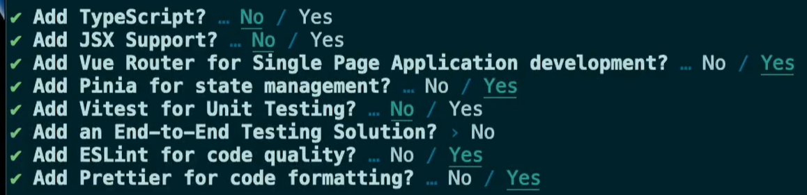

# vue-vite

This template should help get you started developing with Vue 3 in Vite.

## Recommended IDE Setup

[VSCode](https://code.visualstudio.com/) + [Volar](https://marketplace.visualstudio.com/items?itemName=Vue.volar) (and disable Vetur) + [TypeScript Vue Plugin (Volar)](https://marketplace.visualstudio.com/items?itemName=Vue.vscode-typescript-vue-plugin).

## Customize configuration

See [Vite Configuration Reference](https://vitejs.dev/config/).

## Project Setup

```sh
npm install
```

### Compile and Hot-Reload for Development

```sh
npm run dev
```

### Compile and Minify for Production

```sh
npm run build
```

### Lint with [ESLint](https://eslint.org/)

```sh
npm run lint
```

### First Install

- framework : Vue
- variant : Customize with create-vue


### 安裝套件

- vue-axios : https://www.npmjs.com/package/vue-axios

- randomuser API : https://randomuser.me/

### 參考

- Hash Mode : https://router.vuejs.org/guide/essentials/history-mode.html

```
首次安裝, router 設定, 瀏覽器(Web Server)無法運行 :
1. 首次安裝 -> npm run build -> 建立 dist 資料夾
2. 獨立開啟 dist 資料夾 -> 以 Code 開啟 -> 右下角 Go Live
3. 查看網址路徑未有 # -> 點選 About 頁面後重整頁面 -> Cannot GET /about
4. 修改 router/index.js -> createWebHistory -> createWebHashHistory -> npm run build
5. 獨立開啟 dist 資料夾 -> 以 Code 開啟 -> 右下角 Go Live
6. 查看網址路徑自動新增 # -> 點選 About 頁面後重整頁面 -> OK
```

- Env Variables and Modes : https://vitejs.dev/guide/env-and-mode.html#env-variables